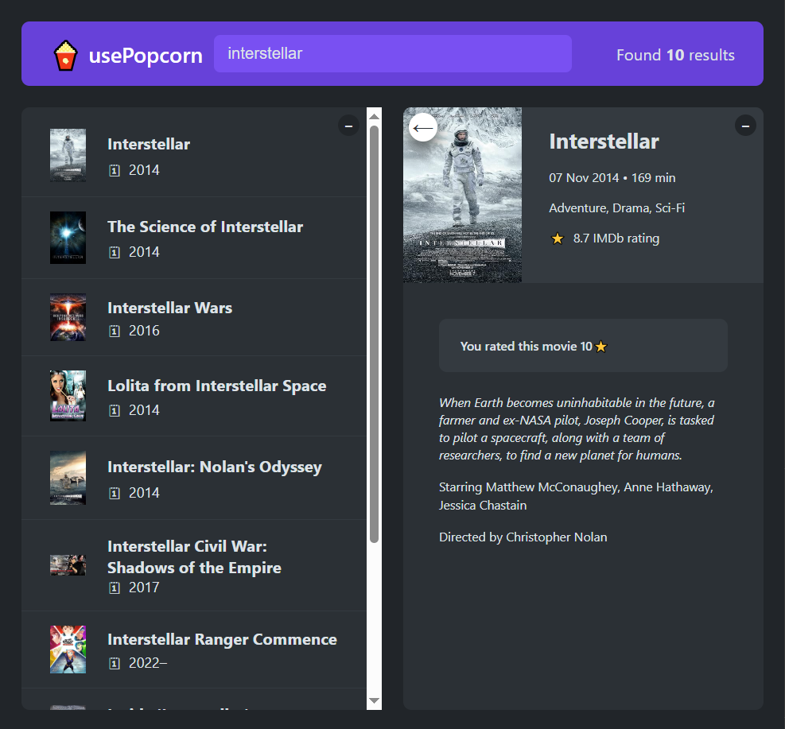

# 🍿 usePopcorn

A fun React app to search movies, track what you’ve watched, and keep quick stats on your movie-watching habits.

---

## 🚀 Features

- 🔍 **Search movies** using the OMDb API (or your chosen API).
- 🎬 **Movie details**: See title, year, poster, and rating.
- ⭐ **Watched list**: Add movies you’ve watched.
- 📊 **Stats dashboard**: Track average rating, runtime, and more.
- ⚡ Built entirely with **React hooks** (useState, useEffect, custom hooks).

---

## 🛠️ Tech Stack

- **React** (functional components + hooks)
- **JavaScript (ES6+)**
- **CSS** for styling
- **OMDb API** for movie data

---

## ⚙️ Installation & Setup

1. Clone the repo:

   ```bash
   git clone https://github.com/ilyajafari/usePopcorn.git
   cd usePopcorn

   ```

2. Install dependencies:
   npm install

3. Get an API key from OMDb API and add it to your environment:
   REACT_APP_OMDB_API_KEY=your_api_key

4. Start the dev server:
   npm start

---

## 📸 Screenshot



---

## 🌟 Learning Purpose:

Using React hooks (state, effects, and custom hooks).
Fetching and handling API data.
Managing local state + persisting with localStorage.
Component composition and state lifting in React.
